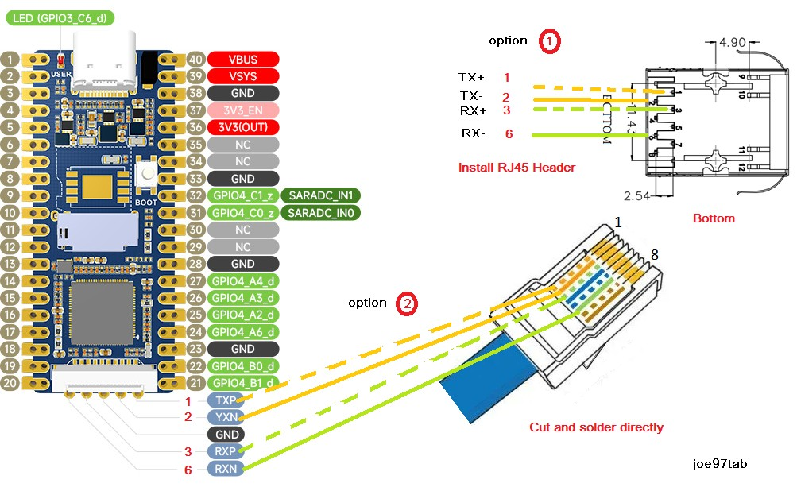

# Luckfox-Pwn-PS4

# Test on ubuntu jammy
# Work in progress, need to test with real hardware.

This is alternative script to using Luckfox Pico to pwn PS4, it included all firmware from 7.00-11.00.

---------------------------------------------------------------------------------------

| PS4 FW | GoldHEN | HEN-VTX | TheOfficialFloW |
| --- | --- | --- | --- |
| 11.00 | o | o | o |
| 10.71 | x | o | o |
| 10.70 | x | o | o |
| 10.50 | x | o | o |
| 10.01 | o | o | o |
| 10.00 | o | o | o |
| 9.60 | o | o | o |
| 9.51 | x | o | o |
| 9.50 | x | o | o |
| 9.04 | x | o | o |
| 9.03 | x | o | o |
| 9.00 | o | o | o |
| 8.52 | x | o | o |
| 8.50 | x | o | o |
| 8.03 | x | o | o |
| 8.01 | x | o | o |
| 8.00 | x | o | o |
| 8.01 | x | o | o |
| 7.55 | x | o | o |
| 7.51 | x | o | o |
| 7.50 | x | o | o |
| 7.02 | x | o | o |
| 7.01 | x | o | o |
| 7.00 | x | o | o |

[TheOfficialFloW](https://github.com/TheOfficialFloW/PPPwn)

The exploit only prints `PPPwned` on your PS4 as a proof-of-concept.

[GoldHEN](https://github.com/GoldHEN/GoldHEN/releases)

You need to place the goldhen.bin file onto the root of a usb drive and plug it into the console.
Once goldhen has been loaded for the first time it will be copied to the consoles internal hdd and the usb is no longer required.

[hen-vtx](https://github.com/EchoStretch/ps4-hen-vtx/releases)

You need to place the payload.bin file onto the root of a usb drive and plug it into the console.
Once hen has been loaded for the first time it will be copied to the consoles internal hdd and the usb is no longer required.

[BestPig](https://github.com/BestPig/ps4-hen-vtx/releases)

No need to place any file onto the root of a usb drive.

---------------------------------------------------------------------------------------
## Wiring

- Option 1 : You can savage RJ45 head and solder to luckfox board, or buy Plus version.
- Option 2 : Solder Ethernet wires directly to luckfox board, I think this option has a low noise.

---------------------------------------------------------------------------------------

## Tips

- First, use IPv6 address and TheOfficialFloW to pwn PS4.
- If it worked then change to IPv4 address.
- If everthing worked change to GoldHEN or HEN.
- no-wait-padi, can reduce pwn time but may miss captured package.
- When pwn the console don't touch anything it will increase the success rate.
- `Cannot connect to network: (NW-31274-7).` It means the program try to injection, sometime the exploit fails or the PS4 crashes.
- `LAN cable not connected.` It means the program will try next attempt, if pwn success it turns off Ethernet and shutdown.
 
---------------------------------------------------------------------------------------

## Credit to everyone that made it worked.
